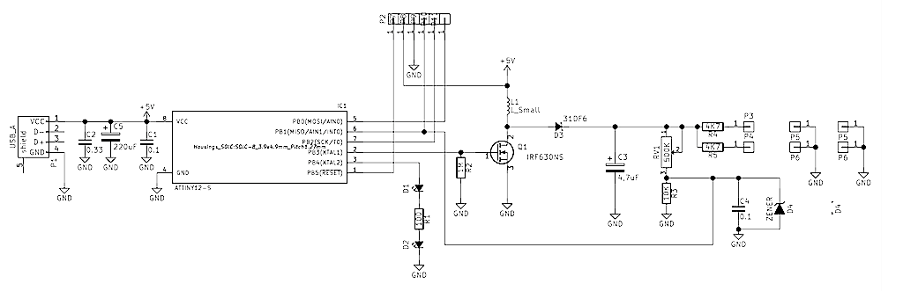

# ledfilament
ATtiny12L 75V LED Filaments driver

These are flexible LED filaments, of which I learned from [this video](http://www.youtube.com/watch?v=H_XiunR-cAQ)
by [mikeselectricstuf](http://www.electricstuff.co.uk/) 
They require around 75V to light up, so a for 
these LEDs is essentially the same as Nixie tube driver, which is awesome.

Using any serious microcontroller for this experiment would be wasteful. Fortunately, I had
an ATtiny12L salvaged from an ink cartridge. Unfortunately, avr-gcc would not even
generate code for it. Fortunately, its task is so simple that it wasn't a trouble at all
to code it in assembly.

This is a boost converter. R2 is a bleed resistor that does not let the MOSFET to stay open 
when the micro is being programmed. The inductor value is anything around 100uH. The 
feedback loop to keep the voltage at set value is implemented using resistor divider
`RV1-R3` and the builtin comparator of ATtiny12L. 

It was also an experiment with homemade UV soldermask. I did not get it at first attempt, 
but it worked out nicely after a few attempts. As usual with UV curable things, the trick 
is to have opaque zones in the transparency really opaque.

-----
2015 Viacheslav Slavinsky http://sensi.org/~svo
